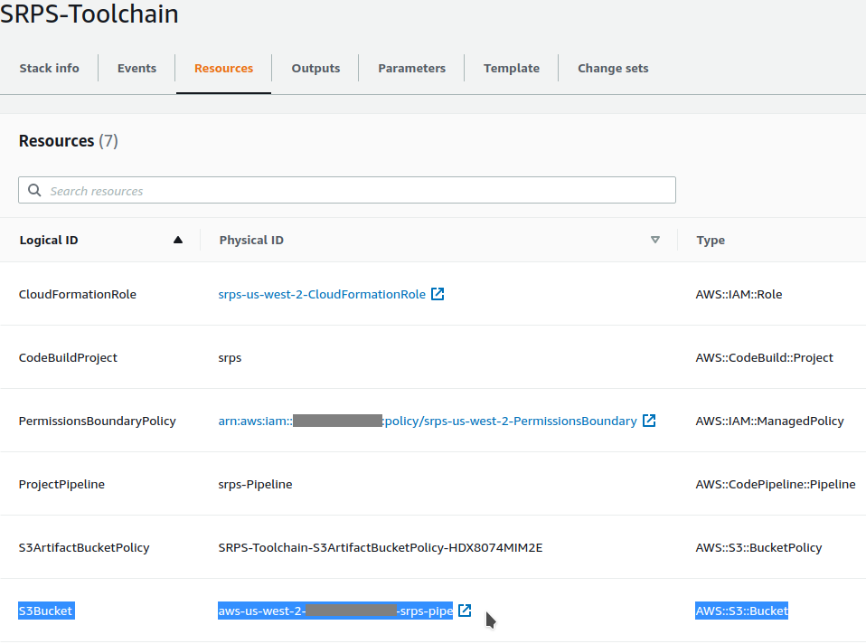
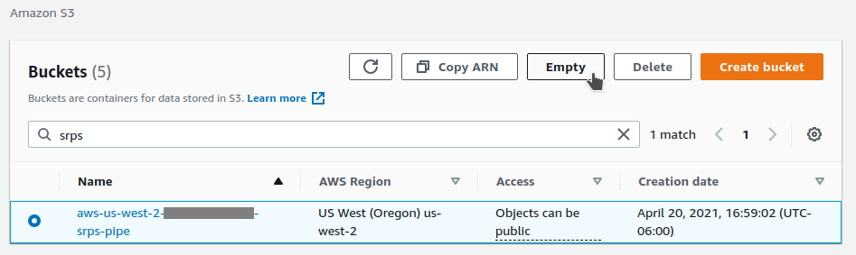

# Decommissioning 

In the following example, the Application Stack (named for the Application ID specified when deploying the Toolchain) is named "srps", and the Toolchain Stack is named "SRPS-Toolchain". Please adjust according to your deployment.

---
**WARNING**

You MUST delete the Application Stack *before* the Toolchain Stack. If you attempt to delete the Toolchain Stack first, you will end up with "dangling" resources, and be unable to remove either stack without manual intervention! If you are uncertain what the Application Stack's name is, refer to the Parameters tab of the Toolchain Stack. Wait for the Application Stack, and its resources, to be deleted, *before* proceeding to delete the Toolchain Stack!

---

<!-- MarkdownTOC autolink="true" levels="1,2" -->

- [1. Pre-Work \(Empty S3 Bucket\)](#1-pre-work-empty-s3-bucket)
- [2. Delete the CloudFormation Stacks](#2-delete-the-cloudformation-stacks)
- [3. Final Cleanup](#3-final-cleanup)
- [Manual intervention after attempting to delete Toolchain Stack before Application Stack.](#manual-intervention-after-attempting-to-delete-toolchain-stack-before-application-stack)

<!-- /MarkdownTOC -->

## 1. Pre-Work (Empty S3 Bucket)

S3 buckets may only be deleted after they are emptied. The Toolchain Stack uses an S3 bucket to store source and build artifacts for the CodePipeline. If you do not first empty the bucket, you will receive an error when attempting to delete the Toolchain Stack. Therefore, we begin the decommissioning process by emptying the S3 bucket.

The correct bucket may be easily located from the CloudFormation Toolchain Stack's Resources tab.

- Navigate to the [AWS S3 console](https://console.aws.amazon.com/s3/home).

- After locating the bucket, click the "Empty" button, and follow the prompts.

## 2. Delete the CloudFormation Stacks

You MUST delete the Application Stack *before* the Toolchain Stack. If you attempt to delete the Toolchain Stack first, you will end up with "dangling" resources, and be unable to remove either stack without manual intervention! If you are uncertain what the Application Stack's name is, refer to the Parameters tab of the Toolchain Stack.

- Navigate to the [CloudFormation console](https://console.aws.amazon.com/cloudformation/home).

- Select the Application Stack (named by the AppId you specified when deploying the Toolchain Stack), click the "Delete" button, and follow the prompts.

- **Wait for the Application Stack, and its resources, to be deleted.**

- You may now delete the Toolchain Stack the same way as the Application Stack.

## 3. Final Cleanup

Finally, there are two manual steps: removing the toll-free phone number, and the GitHub connection.

### Phone Number

- Sign in to the [AWS Pinpoint console](https://console.aws.amazon.com/pinpoint/home).

- Navigate to "Settings -> SMS and voice", and select the phone number used by the application.

- Click the "remove phone number" button, and follow the prompts.

### GitHub Connection

- Sign in to the [AWS CodePipeline console](https://console.aws.amazon.com/codesuite/codepipeline/home)

- Navigate to [Settings -> Connections](https://console.aws.amazon.com/codesuite/settings/connections)

- Select your GitHub Connection, click the "delete" button, and follow the prompts.

## Manual intervention after attempting to delete Toolchain Stack before Application Stack.

If there was an attempt to delete the Toolchain Stack before the Application Stack, the IAM Role used by the Application Stack will have been deleted. As a result, the Application Stack will not have the permissions needed to delete its resources. In this case, attempting to delete the Application Stack will produce an error that the `<AppId>-<AWS Region>-CloudFormationRole` IAM Role is invalid or missing. You may work around this by temporarily creating a new, appropriately named, IAM Role in the correct region, and assigning it the AdministratorAccess policy. You may now attempt to delete the Application Stack.

You will likely find this is, again, insufficient, though, as you are greeted by a litany of resource deletion errors.

To work around these, you may manually delete resources which CloudFormation fails to delete. To do this, navigate to the Resources tab of the Application Stack, locate each resource in "DELETE_FAILED" status, and navigate to the respective AWS Service Console to delete the resource. You may find some resources already deleted, and some resources (such as the "ServerlessRPSFunctionSQSQueueEvent" do not correspond to a tangible resource, but instead represent configuration features of the template). When you believe each failing resource has been addressed, you may re-attempt deleting the Application Stack. With enough manual effort, you will eventually succeed.

Once you've successfully deleted the Application Stack, you will need to manually remove the temporary `<AppId>-<AWS Region>-CloudFormationRole` IAM Role created above. You may do so from the IAM Console's Roles section.

Finally, you may return to the next, regular step in the process: deleting the Toolchain Stack (assuming the CodePipeline S3 bucket has already been emptied).
