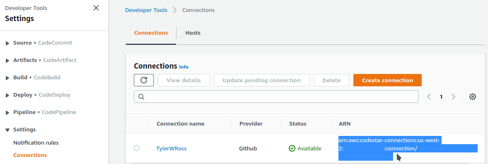

# Deployment

To deploy the continuous-deployment toolchain, start from [Step 1](#1-fork-this-github-repository), and complete all steps.

To deploy only the application, skipping the CD toolchain (which can be added later!), use the AWS SAM CLI (see [SAM CLI Deployment](#sam-cli-deployment)), and then start from [Step 5](#5-configure-a-toll-free-phone-number-for-sms) to configure the application.

If using SAM CLI to update an existing, configured deployment, you do not need to complete the configuration step(s).

It is possible to deploy the Toolchain for an existing Toolchain-less (i.e., SAM CLI only) deployment, leaving the existing application as-is. To do so, simply ensure the AppId parameter specified when deploying the Toolchain exactly matches the AppId/name of the existing Application Stack.

## SAM CLI Deployment

Assuming SAM CLI is installed, use the command `sam deploy --template-file template.yml --guided` from within the root directory of the
repository, and follow the prompts. Alternatively, your IDE of choice may include SAM CLI integration. Once the application has been deployed, start from [Step 5](#5-configure-a-toll-free-phone-number-for-sms) to configure the application.

*NOTE:* If deploying without the toolchain, you must comment-out/remove the `PermissionsBoundary` statement from `template.yml` (in the `Globals` section, near the top of the file), *or* create your own permissions boundary policy and enter its ARN in `template.yml`. The permissions boundary IAM policy is normally defined by the Toolchain. If the template's `PermissionsBoundary` statement is not removed, or correctly updated, deployment will fail. For a discussion of the permissions boundary's purpose, please refer to the [whitepaper](whitepaper.pdf).

The aforementioned `sam deploy` command may also be used to update the Application Stack of a Toolchain-based deployment, and the Toolchain and SAM CLI may be used interchangeably without issue. For faster, more convenient development, using the SAM CLI to rapidly deploy changes (rather than committing, and waiting for the Toolchain Stack to finish processing) is a recommended workflow.

## Deployment and Configuration Steps

<!-- MarkdownTOC autolink="true" levels="3" -->

- [1. Fork this GitHub repository.](#1-fork-this-github-repository)
- [2. Connect your AWS Account to GitHub](#2-connect-your-aws-account-to-github)
- [3. Deploy the Toolchain](#3-deploy-the-toolchain)
- [4. Monitor the Deployment](#4-monitor-the-deployment)
- [5. Configure a Toll-free Phone Number for SMS](#5-configure-a-toll-free-phone-number-for-sms)
- [6. Play Rock-Paper-Scissors!](#6-play-rock-paper-scissors)

<!-- /MarkdownTOC -->

### 1. Fork this GitHub repository.

You may use a private clone. Note the branch name (currently `master`, in this repository), repository owner account name (generally, your GitHub username), and the name of your repository (e.g., "ServerlessRPS"). You will need these to deploy the Toolchain.

### 2. [Connect your AWS Account to GitHub](https://docs.aws.amazon.com/codepipeline/latest/userguide/connections-github.html#connections-github-console)

- Sign in to the [AWS CodePipeline console](https://console.aws.amazon.com/codesuite/codepipeline/home)

- Navigate to [Settings -> Connections](https://console.aws.amazon.com/codesuite/settings/connections)

- Click "Create connection" and follow the prompts to [Create a Connection](https://console.aws.amazon.com/codesuite/settings/connections/create) to GitHub

	- You may choose to restrict this connection to your fork/clone of this repository, or allow it to access all repositories owned by your account.

- Return to to [Settings -> Connections](https://us-west-2.console.aws.amazon.com/codesuite/settings/connections) and note the Connection ARN. You will need this to deploy the Toolchain.

 

### 3. Deploy the Toolchain

- Sign in to the [AWS CloudFormation console](https://console.aws.amazon.com/cloudformation/home).

- Click "create stack" and choose "with new resources."

- Select "template is ready and upload the `Toolchain.yaml` which defines this CloudFormation stack.

 

- Name the Toolchain Stack, specify an Application ID (must be unique to this deployment), and enter the GitHub Connection ARN and GitHub repository details you noted in Steps [1](#1-fork-this-github-repository) and [2](#2-connect-your-aws-account-to-github).

- Proceed past the "configure stack options" step.

- Finally, review the parameters entered, for correctness, and acknowledge that this CloudFormation deployment will create IAM resources.

 

### 4. Monitor the Deployment

The Toolchain will deploy an AWS CodePipeline, and supporting resources, responsible for building and deploying SRPS from the specified GitHub repository. Once the Toolchain is deployed, the CodePipeline will be automatically triggered. After this first deployment, the CodePipeline will be automatically triggered when changes are made to the branch specified in the Toolchain Stack's parameters.

To monitor the progress of CloudFormation (both the Toolchain Stack, and Application Stack), visit the [AWS CloudFormation console](https://console.aws.amazon.com/cloudformation/home).

To monitor the progress of the CodePipeline, visit the [AWS CodePipeline console](https://console.aws.amazon.com/codesuite/codepipeline/home).

### 5. Configure a Toll-free Phone Number for SMS

The user interface for SRPS is SMS messaging. Currently, AWS Pinpoint does not support automatic provisioning, or configuration, of phone numbers. As such, we must manually request and configure one.

- Sign in to the [AWS Pinpoint console](https://console.aws.amazon.com/pinpoint/home). You should see a Pinpoint project, named with the Application ID specified in [Step 3](#3-deploy-the-toolchain).

- Navigate to "Settings -> SMS and voice", and select "request phone number".

- Select your country, the Toll-free number type (long codes do not support SMS; 10DLCs require special registration), ensure the SMS capability is selected, and specify the default message type as transactional.

***NOTE:*** The provisioning of a toll-free number falls outside the AWS Free Tier, and costs $2/month! Additionally, SMS messaging (send and receive) is outside the AWS Free Tier, and incurs a small cost. Please refer to the [AWS Pinpoint Pricing](https://aws.amazon.com/pinpoint/pricing/), for current costs.

- Return to "Settings -> SMS and voice", and select the newly provisioned toll-free number, to configure it.

- To connect the number to the SRPS application, expand the "Two-way SMS" settings.
	
	- Enable two-way SMS

	- Tick "choose an existing SNS topic", and select the `<AppId>-SNSTopicIncomingMessages` topic, where `<AppId>` is the Application ID specified in [Step 3](#3-deploy-the-toolchain)

	- Enabled self-managed opt-outs

		- This last option passes "help" messages directly to our application. Were we not using a toll-free number, "stop" messages would also be passed to our application. However, "STOP" messages for toll-free numbers are handled at the carrier level, and therefore never reach Amazon Pinpoint, or our application.

### 6. Play Rock-Paper-Scissors!

Your deployment of SRPS should now be operational. To begin using it, text "help" to the toll-free number configured in [Step 5](#5-configure-a-toll-free-phone-number-for-sms). You will be greeted with a list of available commands.
